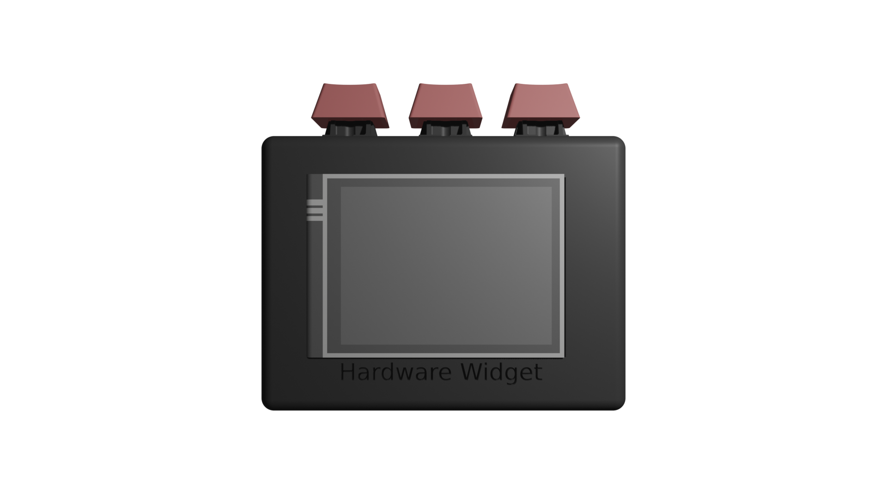
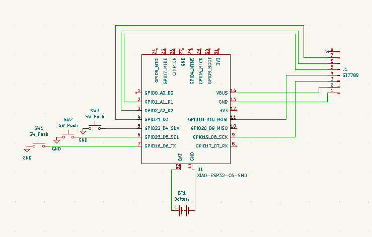

# Hardware Widget



## What is it?

A macropad-like device featuring 3 buttons and a screen, to be used for anything! Currently features a Bluetooth Low Energy music display and controller.

## What it does

Displays information such as song title, song duration, song progress. Allows for the user to play/pause, seek forward/backwards in a track, and play next/previous.

## Why // What makes it unique?

This project was built to have a convenient display on my desk! It also served as a way to experiment with the newer BLE Services, which seem very promising for small peripherals like this. This was also an experiment in embedded Rust, which I found extremely nice to work with, just much less mature and full of rough edges.

Uses the very new BLE Audio Services (Media Control Service) to display music information and controller! This service is very new and is experimental on many operating systems. Enables battery-powered devices like this to have a much longer battery life!

## Internals

Features a Xiao ESP32-C3, with a lithium battery, 3 keycaps & a 2.4" color TFT Display.



## Zine

Check it out [here](./zine.pdf)

## Project Structure

```
.
├── src/
│   ├── lib.rs              # Library entry
│   └── bin/main.rs         # Firmware entry point
├── cad/                    # 3D enclosure (STEP & FreeCAD files)
├── kicad/                  # Schematic and symbols
├── images/                 # Renders, wiring diagram, UI icon assets (.png/.raw)
├── forks/trouble/          # Fork of the `trouble` BLE stack
├── BOM.csv                 # Bill of materials
├── build.rs                # Build script
├── Cargo.toml              # Crate manifest
├── Embed.toml              # probe-rs flashing config
├── runner.sh               # Cargo runner script (combine espflash for speed and probe-rs for JTAG monitoring)
├── rust-toolchain.toml     # Pinned toolchain
└── zine.pdf                # Project zine page
```
